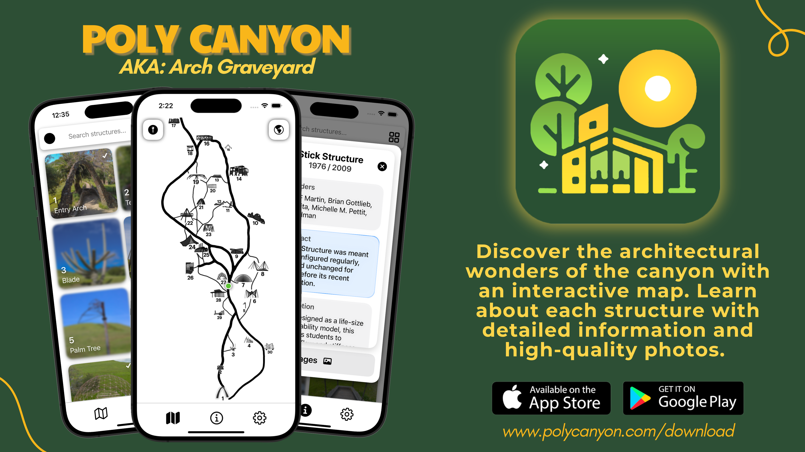

# Poly Canyon

Explore the wonders of Cal Poly's Poly Canyon like never before! This app provides a comprehensive map of all the experimental structures, detailed information, high-quality photos, and an adventure mode to track the structures you've visited.

## Table of Contents
- [About the App](#about-the-app)
- [Repository Structure](#repository-structure)
- [Current Progress](#current-progress)
- [License](#license)
- [Contributing](#contributing)
- [Contact](#contact)

## About the App

Poly Canyon is designed to enhance your experience while exploring Cal Poly's Poly Canyon. The app includes:
- **Comprehensive Map:** Navigate through all experimental structures.
- **Detailed Information:** Learn about each structure with detailed descriptions.
- **High-Quality Photos:** View high-resolution images of the structures.
- **Adventure Mode:** Track which structures you've visited.
- **Virtual Tour Mode:** Journey through the canyon from a distance



For more details about the app, visit the [download page](https://polycanyon.com/download).

## Repository Structure

To learn more about the code, navigate to the respective folders and read the README files contained within them. Here is a brief overview of the repository structure:

```
poly-canyon/
├── assets/       # Contains all the assets used in the app
├── promotional/  # Promotional materials for the app
├── react/        # React components and related code
├── swift/        # Swift code for the iOS app
```

## Current Progress

Currently working on: Full Launch! 


## License
This project is licensed under the Creative Commons Attribution-NonCommercial 4.0 International License - see the [LICENSE](LICENSE) file for details.


## Contributing

Contributions are welcome, please create a new well-named branch, and have a detailed commit message or ideally get in contact before development!


## Contact 

For any questions or feedback, please email me at pjones15@calpoly.edu 
