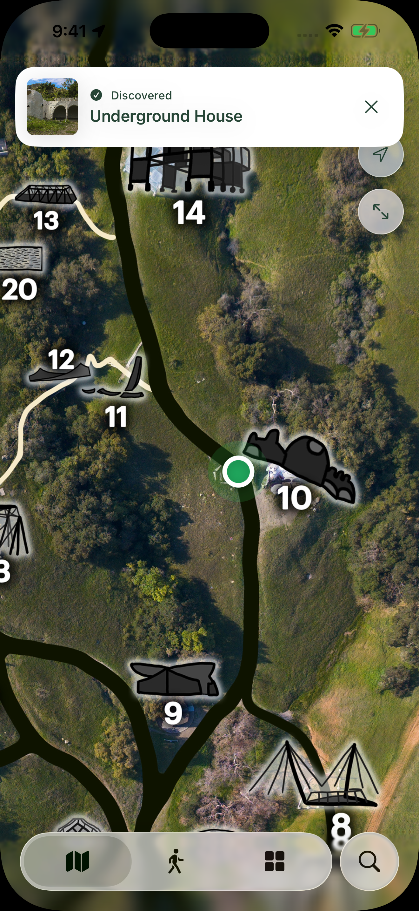
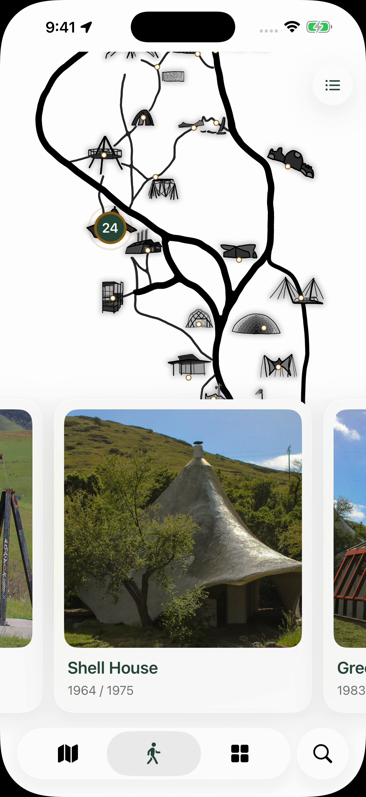
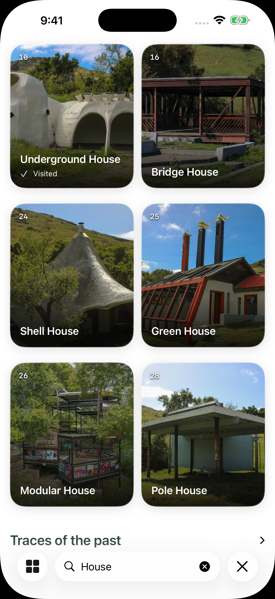

# Poly Canyon

An independent iPhone guide to Cal Poly’s outdoor architecture lab. Discover its student-built houses, bridges, and towers on foot, or take a virtual tour from anywhere.

[Download on the App Store](https://apps.apple.com/us/app/poly-canyon/id6499063781) · [Visit the website](https://polycanyon.com) · [Explore the research](https://polycanyon.com/structures)

  
  
  

## About the project

I built Poly Canyon to connect the structures you see on a walk with the ideas and people behind them. The app brings together an illustrated map, photographs, and histories of 31 structures and six historical sites.

The experience starts with how you want to explore. In the canyon, the map follows your position and marks discoveries as you walk. From anywhere else, swipe through the virtual tour, open a structure’s story, and look through its photographs. Both lead into the same collection, searchable by name, number, or year.

The app puts photographs first, with glass controls, interactive onboarding, and transitions that keep the map, collection, and stories connected. Choose System, Light, or Dark in Info to make it your own.

## Behind the app

Built with SwiftUI, UIKit, and Core Location. Content ships with the app, and visit progress stays on the device. There are no external package dependencies or backend services to set up.

Open `swift/Poly Canyon.xcodeproj` in Xcode and select the **Poly Canyon** scheme. The app supports iOS 16 and later.

[Setup and checks](docs/setup.md) · [Architecture](docs/architecture.md) · [Content and contributing](docs/contributing.md) · [Release](docs/release.md)

Android is retired; its original content is preserved in a clearly marked archive. See the [documentation](docs/README.md) for data, media, and maintenance details, and the [existing license](LICENSE.md) for reuse terms.

Created by Parker Jones. [Questions or corrections](mailto:parker.jones@live.com).
