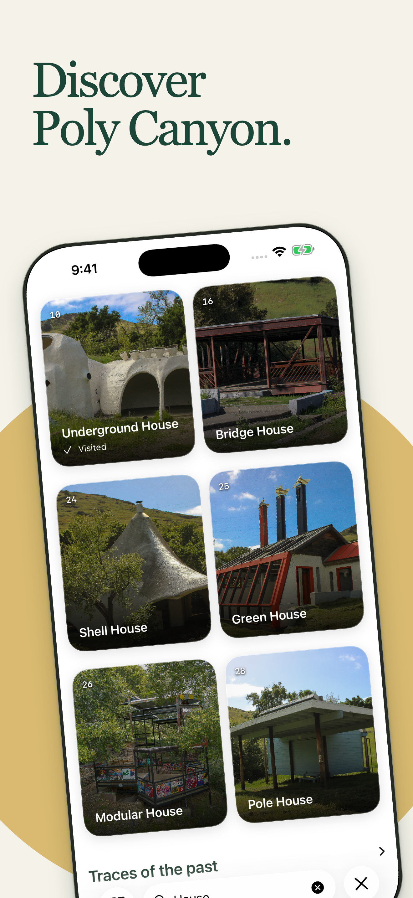
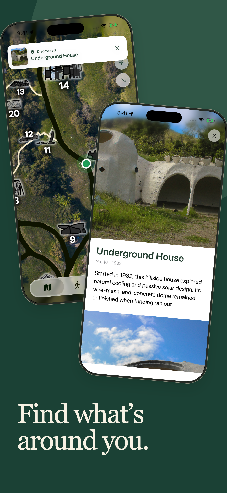
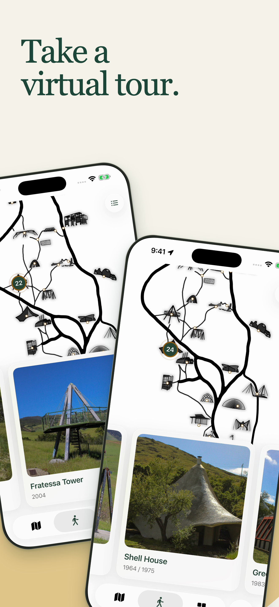
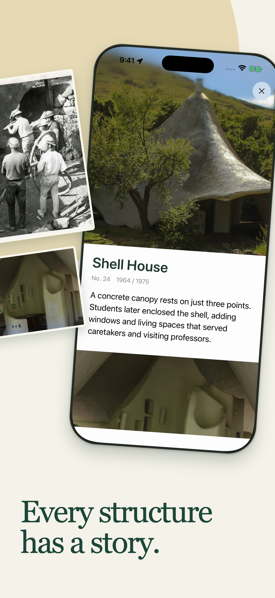

# Promotional material

## Current App Store artwork

The four approved Poly Canyon 6.0 slides, matching the saved App Store draft. Each PNG is 1320 × 2868 pixels.

  
  
  
  

Download the full-size exports from [app-store](app-store/). The [media guide](../docs/media.md) covers actual app captures, provenance, and refreshing screenshots.

## Archive

[archive](archive/README.md) preserves earlier iOS and Android campaigns, posters, and editable Photoshop originals. These are historical assets, not current promotional material. Keep new release artwork outside that folder; archive a campaign when its replacement is approved.
